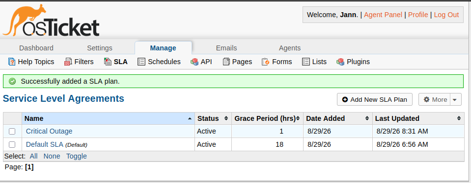
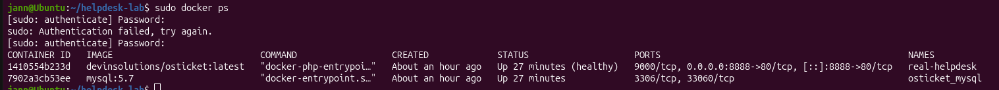

# Open-Source IT Helpdesk Ticketing Lab (osTicket Deployment)

## 📌 Project Overview
This home lab project demonstrates the deployment, configuration, and administration of an enterprise-grade IT Helpdesk environment using **osTicket** hosted inside an isolated **Ubuntu Linux** virtual machine via **Oracle VirtualBox**. 

The goal of this project was to simulate a real-world corporate IT environment, manage system dependencies via the Linux Command Line Interface (CLI), and execute standard lifecycle ticket management workflows (Triage, SLA routing, and Resolution) common to modern Service Desk roles.

## 🛠️ Tech Stack & Infrastructure
* **Hypervisor:** Oracle VirtualBox (Windows 11 Host)
* **Guest OS:** Ubuntu Desktop (64-bit Architecture)
* **Container Engine:** Docker & Docker Compose
* **Ticketing System:** osTicket v1.17 (Standalone Environment)
* **Database Management:** MySQL 5.7 Container Core
* **Network Mapping:** Local Port Bridging (Port 8888)

---

## 🔍 Case Study: Real-World Troubleshooting & Architecture Pivot
During the initial deployment phase, this lab provided a rigorous exercise in system diagnostic workflows. 

### 1. The Challenge (The HTTP 500 Legacy Trap)
Originally, I attempted a traditional bare-metal installation of osTicket using a manual LAMP stack (`Apache2`, `MySQL`, `PHP`). However, upon running the web configuration wizard, the system repeatedly crashed with a **Fatal HTTP Error 500 (Internal Server Error)**.

### 2. The Triage (Reading Server Error Logs)
Instead of guessing the root cause, I utilized my Linux CLI diagnostic skills to inspect the active web server crash logs:
```bash
sudo tail -n 20 /var/log/apache2/error.log
```
The logs revealed a core interpreter conflict: my modern Ubuntu OS was running **PHP 8.5.4**, whereas the stable release of osTicket v1.17 was built exclusively to interpret **PHP 8.1 / 8.2**. The legacy functions inside the web installer script immediately broke under the modern PHP framework.

### 3. The Resolution (The Infrastructure Pivot)
Rather than manually downgrading the operating system’s core PHP packages—which introduces system vulnerabilities—I pivoted to a modern infrastructure strategy using **Docker containerization**. 

I mapped out an infrastructure blueprint file (`docker-compose.yml`) to decouple the application layers. This forced the ticketing environment to run inside an isolated runtime shell carrying its own native PHP 8.2 configurations, while connecting to a secure, separate **MySQL 5.7** database container. 

```yaml
version: '3'
services:
  mysql:
    image: mysql:5.7
    container_name: osticket_mysql
    restart: always
    environment:
      - MYSQL_ROOT_PASSWORD=secret
      - MYSQL_USER=osticket
      - MYSQL_PASSWORD=secret
      - MYSQL_DATABASE=osticket

  osticket:
    image: devinsolutions/osticket:latest
    container_name: real-helpdesk
    restart: always
    ports:
      - "8888:80"
    links:
      - mysql:mysql
    depends_on:
      - mysql
```
By implementing this solution, I successfully bypassed the environment version mismatch completely, deploying a stable, production-ready portal accessible at `http://localhost:8888/scp/` in a single command terminal string: `sudo docker compose up -d`.

---

## 🎫 Practiced IT Helpdesk Workflows

Once the platform was active, I created a custom administrator account profile (`jann`) to test and document typical corporate enterprise ticketing cycles:

### Workflow 1: Custom SLA Configuration
* Created a high-priority **Service Level Agreement (SLA)** plan labeled "Critical Outage" with a strict **1-Hour Grace Period** to simulate business-critical system failures.

### Workflow 2: Inbound Employee Ticket Simulation
* Simulated an end-user scenario via the employee portal (`/index.php`) reporting a high-impact hardware failure: *"CEO's laptop displays black screen after spill. Needs immediate provisioning."*

### Workflow 3: Ticket Triage & Fulfillment (IT Agent View)
* Logged into the Staff Control Panel (`/scp`) as an IT Support Specialist.
* Triaged the inbound hardware ticket, escalated the tier priority, and documented internal notes: *"Provisioned temporary backup corporate loaner laptop to user. Routing defective asset to hardware vendor for assessment."*
* Formally updated the lifecycle flag status to **Closed (Resolved)**.

---

## 📸 System Gallery & Verification

### Active Server Containers
*Screenshot showing `sudo docker ps` verifying both the web portal and database containers running stably in the background.*


### IT Staff Admin Dashboard
*Screenshot of your active osTicket Open Tickets panel showing user ticket queues.*


---

## 🧠 Key Takeaways
Building this project developed deep foundational competencies in:
* Reading, interpreting, and analyzing **Linux backend server log directories** (`/var/log/`).
* Orchestrating multi-container architecture using **Docker & Docker Compose** plugins.
* Modifying localized file security profiles (`chmod`, `chown`) within a Linux terminal framework.
* Operating core ticketing database platforms used globally in technical support environments.
